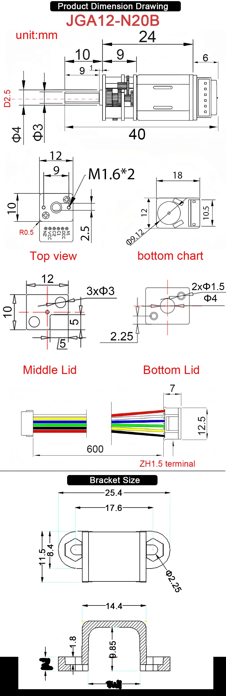
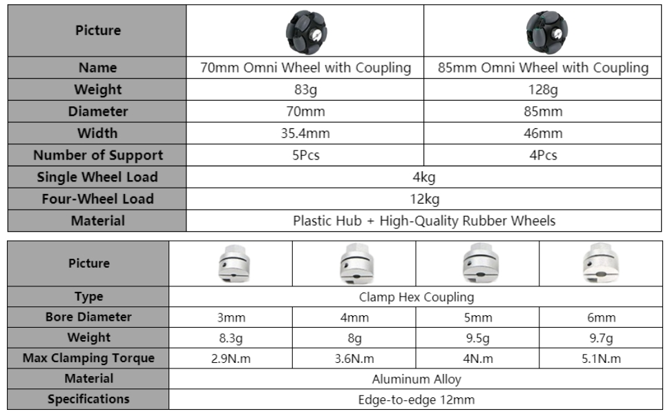
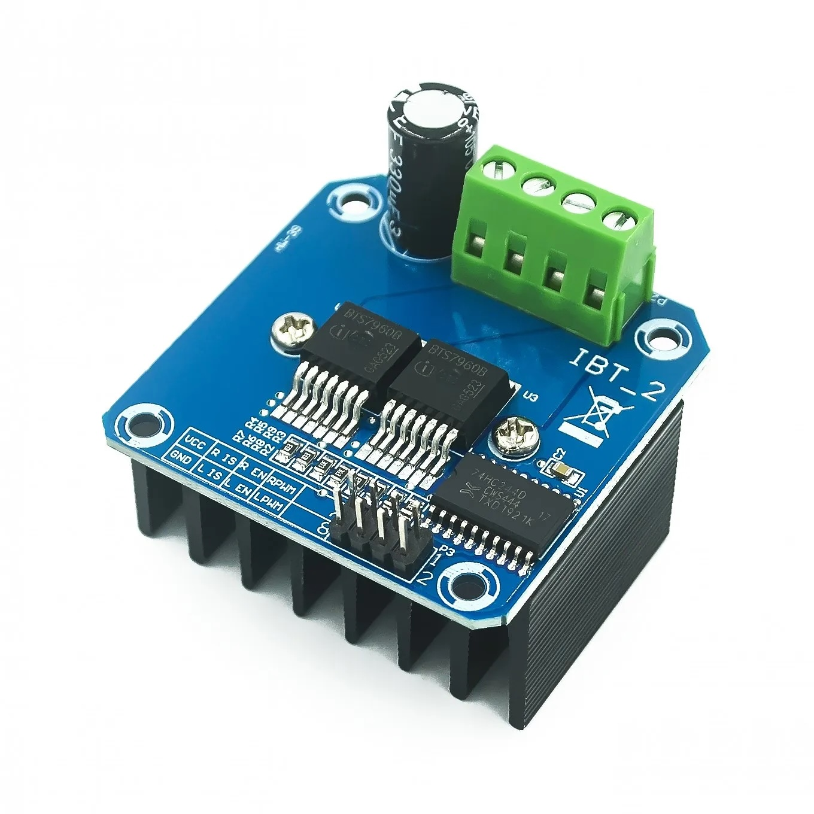
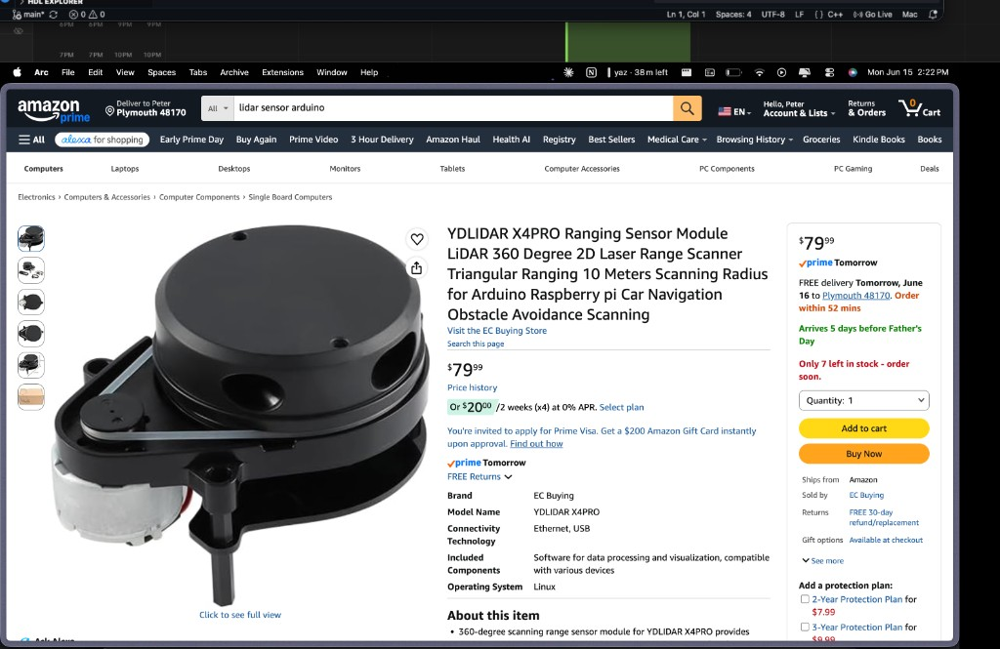
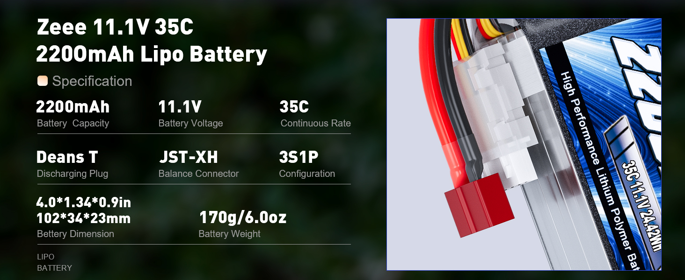
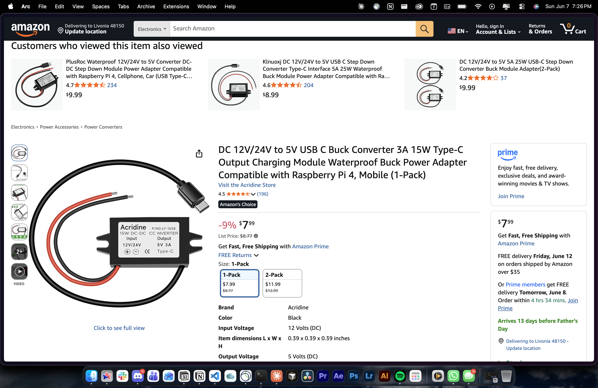

# Chassis Dimensions Reference

Dimensions for CAD / laser-cut layout. All values in **mm** unless noted.

**Sources:** product photos in `part-photos/`, order records, manufacturer datasheets. Items marked ⚠️ need physical measurement or model confirmation.

Last updated: 2026-06-15

---

## Quick Reference

| Part | L × W × H | Weight | Mount / shaft | Chassis notes |
|------|-----------|--------|---------------|---------------|
| JGA12-N20B motor | 40 × 12 × 18 | — | M1.6×2 (9 mm spacing), **φ3 mm D-shaft** | Use included bracket; see motor drawing |
| Motor bracket | 25.4 × 14.4 × 9.85 | — | φ2.25 mm holes, 17.6 mm spacing | U-clamp over gearbox face |
| 70 mm omni wheel | **φ70** × 35.4 wide | 83 g | **3 mm** clamp coupling | Ground clearance ≈ 35 mm to axle |
| 3 mm hex coupling | 12 edge-to-edge | 8.3 g | Clamps onto motor shaft | Matches N20 shaft |
| BTS7960 (IBT-2) driver ×3 | 50 × 50 × 43 | ~66 g | 4× corner holes (M3 typical) | Needs airflow; one per motor |
| Raspberry Pi 5 | 85 × 56 × ~17 | 45 g | 4× M2.5 holes (58 × 49 mm pattern) | Standoffs; leave USB/power side clear |
| Pi 5 active cooler | 63.5 × 42.5 × 13.7 | — | Clips to Pi 5 | **+13.7 mm** above board on CPU side |
| Pi Camera Module ⚠️ | 25 × 24 × ~11.5 | — | 2× M2 holes (CM2/CM3 PCB) | Confirm which module you have |
| YDLIDAR X4PRO | **110.6 × 71.1 × 52.3** | — | Base plate, center mount | **360° clear** above deck; see datasheet |
| Zeee 3S LiPo 2200 mAh | 102 × 34 × 23 | 170 g | Velcro / strap bay | T-plug + JST-XH stick out ~15 mm |
| Buck converter (LY-1658) | ~45 × 20 × 10 ⚠️ | — | 2× tab screw holes | Measure on arrival; not on Amazon listing |
| MG996R servo ×2 (planned) | 40.7 × 19.7 × 42.9 | 55 g | M3, 40 × 49 mm hole pattern | Gimbal pan + tilt |
| Birch plywood sheet | 305 × 305 × 3 | — | — | Stock material |

---

## Drive Train

### JGA12-N20B encoder motor (ordered ×4)



| Dimension | Value |
|-----------|-------|
| Overall length (rear to shaft tip) | **40** |
| Motor body length | 24 |
| Gearbox length | 9 |
| Rear overhang | 6 |
| Face plate (mounting face) | **12 × 10** |
| Motor body cross-section | 12 × 18 (φ9.12 motor can) |
| Output shaft | **φ3 mm**, **10 mm** long, D-flat **2.5 mm** deep × 9 mm |
| Shaft shoulder | φ4 mm at gearbox |
| Mounting holes (face) | **M1.6×2**, **9 mm** center-to-center |
| Encoder connector | 6-pin ZH1.5, 600 mm cable |

**Included bracket**

| Dimension | Value |
|-----------|-------|
| Overall width (tab to tab) | 25.4 |
| Mount hole spacing | 17.6 |
| Mount hole diameter | φ2.25 |
| Bracket width (cross-section) | 14.4 |
| Internal height | 9.85 |
| Base thickness | 1.8 |
| Bottom opening | 10.1 |

**CAD tip:** Motor mounts to chassis through bracket tabs, not directly through the M1.6 face holes. Leave **≥45 mm** clearance along motor axis (motor body + coupling + wheel hub).

---

### 70 mm omni wheel + 3 mm coupling (ordered ×3)



| Dimension | Value |
|-----------|-------|
| Wheel diameter | **70** |
| Wheel width (tread) | **35.4** |
| Roller supports | 5 |
| Load (single / 4-wheel) | 4 kg / 12 kg |
| Coupling type | Clamp hex, aluminum |
| Coupling bore | **3 mm** (matches N20 shaft) |
| Coupling size | 12 mm edge-to-edge |
| Max clamp torque | 2.9 N·m |

**CAD tip:** Axle height from ground ≈ **35 mm** (half wheel diameter). Wheel width extends **±17.7 mm** from axle centerline. Leave **≥75 mm** diameter sweep per wheel corner (roller overhang).

> **Note:** `part-list.md` Amazon link shows a 5 mm coupling variant — your order (`orders.csv`) is **3 mm**, which matches the motor shaft. Use 3 mm in CAD.

---

### BTS7960 / IBT-2 motor driver (ordered ×3)



| Dimension | Value |
|-----------|-------|
| Board (L × W × H) | **50 × 50 × 43** (incl. heatsink) |
| Weight | ~66 g |
| Mounting | 4× corner holes (typically M3) |
| Power input | 6–27 V (B+/B− screw terminal) |
| Motor output | M+/M− screw terminal |
| Logic header | 8-pin 2.54 mm (RPWM, LPWM, R_EN, L_EN, R_IS, L_IS, VCC, GND) |

**CAD tip:** Stack 3 drivers side-by-side = **≥150 mm** width if laid flat. Mount vertically on standoffs to save footprint. Keep heatsink fins unobstructed.

---

## Compute + Sensors

### Raspberry Pi 5 + active cooler (in hand)

| Dimension | Value |
|-----------|-------|
| Board (L × W) | **85 × 56** |
| Board thickness | ~1.6 mm PCB; tallest components ~17 mm |
| Mounting holes | 4× **M2.5**; hole pattern **58 × 49 mm** (corner to corner) |
| Hole diameter | ~2.7–3.0 mm |
| Active cooler footprint | **63.5 × 42.5** |
| Active cooler height above board | **+13.7** |
| USB-C power | Right side — leave **10 mm** cable bend radius |
| GPIO header | 40-pin, 2.54 mm pitch along board edge |

**CAD tip:** Total stack height with cooler ≈ **30–32 mm**. Use **M2.5 standoffs 11–15 mm** to allow airflow under board. Keep camera ribbon route (between CSI connector and board edge) unblocked.

---

### YDLIDAR X4PRO (in hand ×1)



[Amazon listing](https://www.amazon.com/EC-Buying-Triangular-Raspberry-Navigation/dp/B0D3CWVSZX) · [YDLIDAR product page](https://www.ydlidar.com/product/ydlidar-x4-pro) · [Datasheet (PDF)](https://static.generation-robots.com/media/YDLIDARX4PRODatasheet.pdf)

| Dimension | Value |
|-----------|-------|
| Body (L × W × H) | **110.6 × 71.1 × 52.3** |
| Scan angle | **360°** |
| Range | **0.12–10 m** (indoor, 80% reflectivity) |
| Ranging frequency | 5000 Hz |
| Scan frequency | 6–12 Hz (PWM speed control) |
| Angle resolution | 0.43° @ 6 Hz – 0.86° @ 12 Hz |
| Accuracy | ±2 cm (≤1 m); ±3.5% (1–6 m) |
| Supply voltage | **4.8–5.2 V** (use buck converter 5 V rail) |
| Working current | 330 mA typical; 800–1000 mA startup |
| Interface | **UART** (3.3 V logic) |
| ROS2 driver | `ydlidar_ros` / `ydlidar_ros2_driver` |

**CAD tip:** Mount **centered on top deck**. Keep **≥60 mm radius** clear of obstructions at scan plane height. Budget **≥53 mm** stack height above deck. Power from Pi 5 USB or dedicated 5 V rail — not 3.3 V. Route UART to Pi GPIO (3.3 V level).

**Mounting:** Black base plate with side motor + belt drive to rotating head. Use manufacturer mechanical drawing for exact hole positions ([X4PRO drawing PDF](https://aifitlab.com/products/ydlidar-x4-pro-lidar)).

---

### Raspberry Pi Camera Module (in hand ×2) ⚠️

Model not confirmed. Dimensions below are for **Camera Module 2 / 3** (most common Pi ribbon cameras).

| Dimension | Value |
|-----------|-------|
| PCB (L × W × H) | **25 × 24 × 11.5** (CM3 standard; Wide = 12.4 mm H) |
| Mounting holes | 2× **M2**, same positions as CM2 |
| Ribbon connector | 15-pin FPC, 200 mm cable typical |
| Lens protrusion | ~2–3 mm above PCB |

**Action:** Check label on module or ribbon — note model in `inventory.md` after confirming.

---

## Power

### Zeee 3S LiPo 2200 mAh (in hand ×2)



| Dimension | Value |
|-----------|-------|
| Pack (L × W × H) | **102 × 34 × 23** |
| Weight | 170 g |
| Connector (power) | Deans **T-plug** (add ~20 mm to length) |
| Connector (balance) | JST-XH 4-pin |
| Voltage | 11.1 V (3S) |

**CAD tip:** Battery bay ≥ **110 × 40 × 28 mm** with foam strap. Route T-plug toward buck converter; keep away from Pi. Add **XT60 or T-to-screw-terminal adapter** if hard-wiring.

---

### DC 12 V → 5 V USB-C buck converter (in hand)



| Dimension | Value |
|-----------|-------|
| Model | Acridina LY-1658 (label) / P/N L116666 (inventory) |
| Input | 12–24 V (red/black leads) |
| Output | 5 V 3A USB-C |
| Enclosure | Potted, 2× mounting tabs with screw holes |
| Size | **⚠️ measure on arrival** — Amazon listing is wrong (~10 mm cube) |

**CAD tip:** Mount near battery with input wires short. USB-C cable to Pi 5 power port — leave service loop.

---

## Gimbal (planned — Week 5+)

### MG996R servo ×2

| Dimension | Value |
|-----------|-------|
| Body (L × W × H) | **40.7 × 19.7 × 42.9** |
| Weight | 55 g |
| Mount hole spacing | **40 mm** (horizontal) × **49 mm** (vertical) |
| Mount holes | φ3.0 → **M3** screws |
| Output shaft spline | ~25T, ~6 mm diameter |
| Shaft protrusion | ~3–4 mm above body |

**CAD tip:** Pan servo flat on deck; tilt servo on horn bracket. Clearance hole for spline ≥ **7 mm**. CF tube mount: **φ20 mm** tube, ~300 mm length (planned).

---

## Materials

### Birch plywood (ordered)

| Dimension | Value |
|-----------|-------|
| Sheet size | **305 × 305** (12" × 12") |
| Thickness | **3** (1/8") |
| Pack qty | 12 sheets |

---

## Suggested Chassis Layout (3-wheel omni)

Based on `docs/sketches/initial-design.jpg`:

```
                    [ LiDAR — center, top deck ]
                           |
              [ Pi 5 + cooler — rear/center ]
                           |
         [ Camera + gimbal post — front center ]
                           |
    [ Battery ]  [ 3× BTS7960 ]  [ Buck conv. ]
                           |
              _____________|_____________
             /        chassis plate       \
        [wheel]                        [wheel]
                    [wheel]
```

### Minimum deck sizes (starting point)

| Zone | Min footprint | Min height above deck |
|------|---------------|----------------------|
| Wheel corners (3×) | 75 mm dia. each at triangle vertices | Axle at 35 mm from ground |
| Motor + bracket per corner | 30 × 45 mm mount plate | — |
| Electronics bay | 120 × 80 mm | 45 mm (drivers + wiring) |
| Pi stack | 90 × 60 mm | 35 mm |
| Battery bay | 110 × 40 mm | 28 mm |
| LiDAR pad (center) | **115 × 75 mm** | **53 mm** above deck |
| Gimbal post (front) | 50 × 50 mm base | 80–120 mm above deck |

### 3-wheel omni wheelbase

For a triangular layout with 70 mm wheels, a **120–150 mm** spacing between wheel centers is a reasonable starting point for a small indoor robot. Tune in CAD so rollers don't collide with chassis edge at max steering angle.

---

## Measure When Parts Arrive

- [ ] Pi Camera — confirm CM1 / CM2 / CM3 / HQ
- [ ] Buck converter — L × W × H and tab hole spacing
- [ ] BTS7960 — confirm mount hole spacing (measure board)
- [ ] N20 motor — verify bracket included in AliExpress shipment
- [ ] Omni wheel coupling — confirm 3 mm bore on physical part

---

## Related Files

- [part-list.md](part-list.md)
- [inventory.md](inventory.md)
- [orders.csv](orders.csv)
- [initial design sketch](../../docs/sketches/initial-design.jpg)
