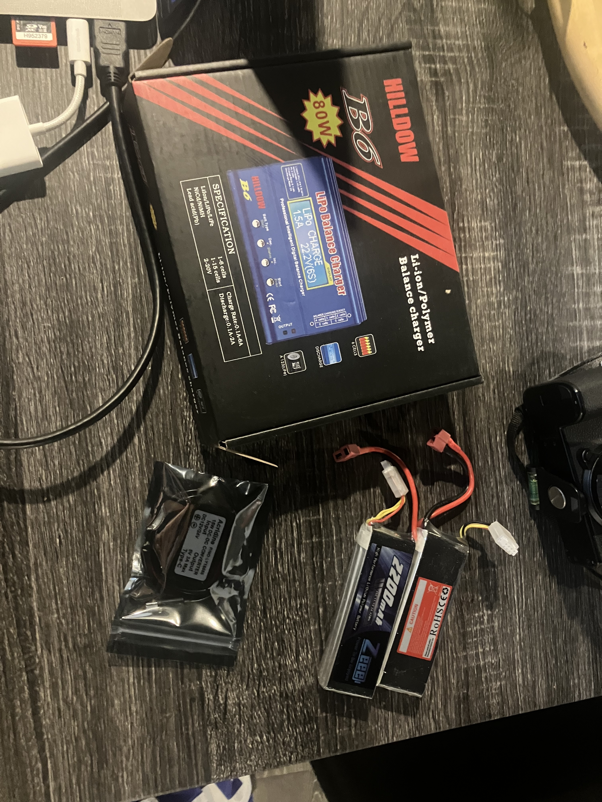

# Fred Film Bot — Hardware Inventory

Last updated: 2026-06-14

## Compute
| Item | Qty | Notes |
|------|-----|-------|
| Raspberry Pi 5 + active cooler | 1 | Primary robot brain |
| Raspberry Pi 4 | 1 | Available for testing/development |
| Arduino R4 WiFi | 2 | Available for peripheral control |

## Cameras
| Item | Qty | Notes |
|------|-----|-------|
| Raspberry Pi Camera Module | 2 | Specs unknown — check ribbon connector type |

## Sensors
| Item | Qty | Notes |
|------|-----|-------|
| LiDAR + controller | 1 | Model unknown — verify ROS2 driver support |

## Motor Control
| Item | Qty | Notes |
|------|-----|-------|
| L298N motor driver | 3 | Max 10V motor supply — not for 12V LiPo use |
| TT gear motor dual shaft 3-6V + bracket + wheels | 4 | Good for early prototyping |

## Power
| Item | Qty | Notes |
|------|-----|-------|
| HILLDOW B6 80W balance charger + power supply | 1 | Li-ion/LiPo/LiFe 1–6S; includes XT60, JST, T connectors |
| Zeee 3S LiPo 2200mAh 11.1V 35C | 2 | T connector (Deans) |
| DC 12V→5V USB-C buck converter 3A 15W | 1 | Acridina L116666 — powers Pi 5 from LiPo |
| 9V battery | 2 | |
| 9V battery → DC barrel jack adapter | 4 | |
| On/off switch (wired) | 9 | |

## Prototyping
| Item | Qty | Notes |
|------|-----|-------|
| 400-point breadboard | 8 | |
| 830-point breadboard | 1 | |
| MicroSD 32GB | 1 | Use for ROS2 — upgrade to 64GB if storage runs low |
| Assorted wires + transistors | — | Qty unspecified |
| 9–12V LED 5mm wired | ~30 | |

## Tools
| Item | Qty | Notes |
|------|-----|-------|
| Soldering kit | 1 | |
| Wire cutters | 1 | |
| Box cutter | 1 | |
| Wood glue | 1 | |
| Masking tape | 1 | |

## Materials
| Item | Qty | Notes |
|------|-----|-------|
| Wooden sticks | — | Qty unspecified |
| Origami paper 15×15cm | ~40 | |

## On Order
| Item | Qty | Supplier | Order # | ETA | Status |
|------|-----|----------|---------|-----|--------|
| JGA12-N20B encoder motor 200RPM 12V | 4 | AliExpress | 8212329737371495 | Jun 16–24 | ordered |
| 70mm omni wheel + 3mm coupling | 3 | Amazon | 113-8814706-5927456 | Jun 22–Jul 2 | ordered |
| BTS7960 motor driver | 3 | Walmart | 2000149-49464347 | Jun 22–Jul 2 | ordered |
| Ninekong birch plywood 12×12 1/8″ 12-pack | 1 | Amazon | 112-0041733-2565822 | Jun 15 | ordered |